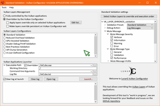
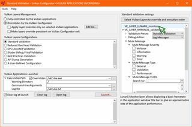
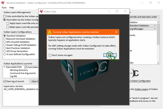
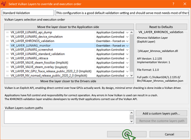
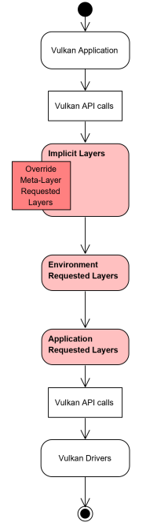
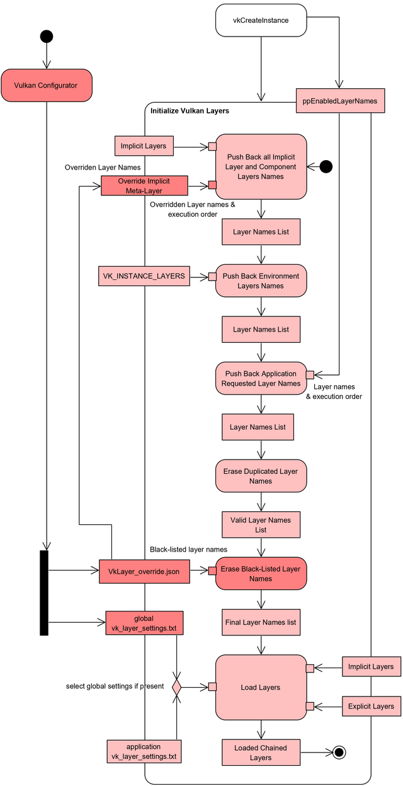

*Vulkan Configurator* allows overriding the [layers configuration](https://github.com/KhronosGroup/Vulkan-Loader/blob/master/loader/LoaderAndLayerInterface.md#layers) used by Vulkan applications at runtime.

A Vulkan application may configure layers when creating a Vulkan Instance. This layers configuration may be overridden using *Vulkan Configurator* globally or for a selected list of Vulkan applications.

Finally *Vulkan Configurator* allows using layers from user-defined directories.

* **Bug reports**: Please submit [GitHub issues](https://github.com/LunarG/VulkanTools/issues) if you encounter any issue.
* **Contact**: [richard@lunarg.com](mailto:richard@lunarg.com)
* **Information for contributors**: [All contribution information](../CONTRIBUTING.md), [Compilation instructions](#compiling), [Roadmap](#roadmap), [Known Issues](#known-issues)

Copyright &copy; 2015-2020 LunarG, Inc.

Screenshots
--------------

|  |  |
| --- | --- |
|  |  |

Platform Support
--------------

| Windows                  | Linux                    | macOS                    |
| ------------------------ | ------------------------ | ------------------------ |
| :heavy_check_mark:       | :heavy_check_mark:       | :heavy_check_mark:       |

Downloads
--------------

*Vulkan Configurator* is part of [Vulkan SDK](https://vulkan.lunarg.com/sdk/home#windows) releases.

License
--------------
*Vulkan Configurator* is part of Vulkan Tools released under the [Apache 2.0 license](../LICENSE.txt).

Using the Vulkan Configurator
--------------
The Vulkan Configurator is a graphical user interface (GUI) that may be launched from the console using `vkconfig`.

The tool is distributed differently, depending on the platform:
- Ubuntu packages: Upon installing the `lunarg-vkconfig` package, the tools will be available from the command line as `vkconfig`.
- Linux tarball: After extracting the SDK, run `./vulkansdk lunarg-tools` to build `vkconfig`. Note that the Core, GUI, and Widgets modules of Qt5 must be installed prior to running the build script.
- Windows: The tool will be present on the start menu, in the Vulkan SDK menu.
- macOS: The tool is provided as an application bundle. Run it by double clicking the bundle from a file explorer.

Compiling
--------------

**TODO**
- Tools that needs to be installed
- Things that needs to be the %PATH% 
- Command lines, actions to build

**TODO**

Glossary
--------------
***[Vulkan Layer](https://github.com/KhronosGroup/Vulkan-Loader/blob/master/loader/LoaderAndLayerInterface.md#layers)***: A layer is optional library that can intercept Vulkan functions on their way from the Vulkan application down to the Vulkan drivers. Multiple layers can be chained together to use multiple layer functionalities simultanously.

***Vulkan Layers Configuration***: A collection of Vulkan Layers executed in [a specific order](https://github.com/KhronosGroup/Vulkan-Loader/blob/master/loader/LoaderAndLayerInterface.md#overall-layer-ordering) with specific settings for each layer.

***Vulkan [Explicit Layers vs Implicit Layer](https://github.com/KhronosGroup/Vulkan-Loader/blob/master/loader/LoaderAndLayerInterface.md#implicit-vs-explicit-layers)***: An explicit layer has to be explicitly activated by the user request from source in `vkCreateInstance`, using Vulkan Configurator or `VK_INSTANCE_LAYERS` environment variable. Implicit layers are enabled by their existence on the system by default.

***Vulkan [Meta-Layer](https://github.com/KhronosGroup/Vulkan-Loader/blob/master/loader/LoaderAndLayerInterface.md#meta-layers)***: Meta-layers are a special kind of layer which is only available through the desktop loader. While usual layers are associated with one particular library, a meta-layer is actually a collection layer which contains an ordered list of other layers called *component layers*. 

***Vulkan Layer settings***: Per layer settings loaded by each layer libraries and stored in the `vk_layer_settings.txt` file which seats next to the Vulkan application executable or that is globally applied to all Vulkan applications. These settings are discribed [here for VK_LAYER_KHRONOS_validation](https://github.com/KhronosGroup/Vulkan-ValidationLayers/blob/master/layers/vk_layer_settings.txt) and [here for other layers created by LunarG](https://github.com/LunarG/VulkanTools/blob/master/layersvt/vk_layer_settings.txt).

***[Vulkan Override Layer](https://github.com/KhronosGroup/Vulkan-Loader/blob/master/loader/LoaderAndLayerInterface.md##override-meta-layer)***: The Vulkan Override Layer is an implicit meta-layer found on the system with the name `VK_LAYER_LUNARG_override` and it is the mecanism used by *Vulkan Configurator* to override Vulkwn applications layers. This layer contains:
- The ordered list of layers to activate
- The list of layer to back-list
- The list of paths to executables that the override applies to. If this list is empty, the override is applied to every application upon startup.

Vulkan Layers execution order overview
--------------

Vulkan Loader and Layers design overview
--------------

For detailed information, read the [Architecture of the Vulkan Loader Interfaces](https://github.com/KhronosGroup/Vulkan-Loader/blob/master/loader/LoaderAndLayerInterface.md) document.

OS User-Specific Monifications
--------------

The *Vulkan Configurator* does not make any system-wide changes to a system, but it does make user-specific changes.
These changes are documented below:

### Linux/Mac

Unix systems store files in the following paths:

- `$HOME/.local/share/vulkan/implicit_layer.d/VkLayer_override.json` tells a Vulkan application which layers to use
- `$HOME/.local/share/vulkan/settings.d/vk_layer_settings.txt` tells Vulkan layers which settings to use
- `$HOME/.config/LunarG/vkconfig.conf` stores the application settings for `vkconfig`

### Windows

Windows systems store files in the following paths:

- `%TEMP%\VulkanLayerManager\VkLayerOverride.json` tells a Vulkan application which layers to use
- `%TEMP%\VulkanLayerManager\vk_layer_settings.txt` tells Vulkan layers which settings to use

In addition, Windows system create registry entries in the following locations:

- `HKEY_CURRENT_USER\Software\Khronos\Vulkan\ImplicitLayers` will have an entry that points to the JSON file above
- `HKEY_CURRENT_USER\Software\Khronos\Vulkan\Settings` will have an entry that points to the text file above
- `HKEY_CURRENT_USER\Software\LunarG\vkconfig` stores the application settings for `vkconfig`

Roadmap
--------------

- Full coverage of [VK_EXT_debug_utils](https://www.khronos.org/registry/vulkan/specs/1.2-extensions/man/html/VK_EXT_debug_utils.html) for message filtering.
- Refactor the loader to replace `vk_layer_settings.txt` and `VkLayer_override.json` by json files generated by `Vulkan Configurator`.
	- Global layers overriding file is placed in `VulkanLayerManager` directory.
	- Local layers overriding file / selected Vulkan application is placed the application directory.
- Improve layer ordering representation and accuracy.
- Add Import and export of layers configurations.
- When an old loader is present on the system, disable the "Apply layers override only on selected Vulkan applications" checkbox and use tool tip to tell the user the loader is too old.
- Add multiple command line arguments and environment variables per application.
- Add a search field for the launcher log area and button to open the launcher log file, make it possible to browse the log.
- Make vkconfig a service to add an icon in the taskbar when running.

Known Issues
--------------

- Tool tips are not yet implemented.
- Missing description for each layer settings.
- Layers will use the override layer settings and ignore the local file with no warning to the user.
- Layer paths may not be duplicated in the layer override json file. They currently are.
- Layer execution order express in the "Select Vulkan Layers to override and execution order" window is not accurate, only ***forced on*** layers can be ordered.
- Layers settings fields are not checked for syntax errors.

