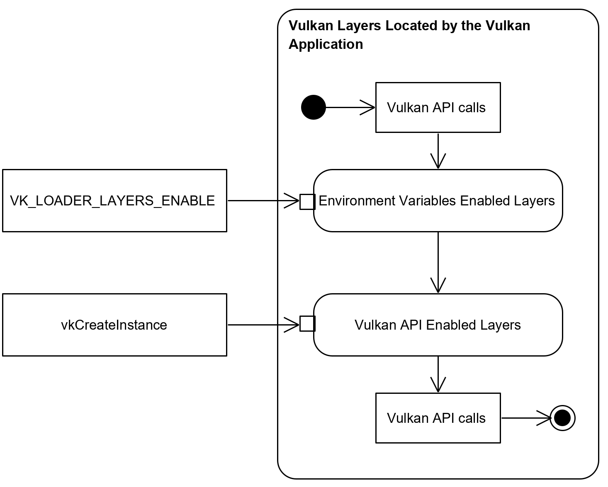

<!-- markdownlint-disable MD041 -->

Copyright &copy; 2015-2025 LunarG, Inc.

[![Creative Commons][3]][4]

[3]: https://i.creativecommons.org/l/by-nd/4.0/88x31.png "Creative Commons License"
[4]: https://creativecommons.org/licenses/by-nd/4.0/

[Vulkan layers](https://github.com/KhronosGroup/Vulkan-Loader/blob/main/docs/LoaderInterfaceArchitecture.md#layers) allow application developers to add functionality to Vulkan applications without modifying the application itself, e.g.: validating API usages, dumping API entry points or generating screenshots of specified frames.

Configuring layers means multiple tasks:
* Enabling layers, selecting which layer will be executed
* Ordering layers, choosing the order of the layer execution between the Vulkan application and the Vulkan driver.
* Configuring each layer capabilities

[Vulkan layers can be configured using three different methods](https://vulkan.lunarg.com/doc/view/latest/windows/layer_configuration.html) to match specific Vulkan developers' workflows:
* Using Vulkan Loader (`VK_LOADER_LAYERS_ENABLE`) and Vulkan Layers environment variables.
* Using the Vulkan API: `vkCreateInstance()` and the `VK_EXT_layer_settings` extension since *Vulkan 1.3.272*.
* Using Vulkan Loader settings and the `vk_layer_settings.txt` file using *Vulkan Configurator* since *Vulkan 1.3.284*.

*Vulkan Configurator 3* requires *Vulkan Loader 1.4.304* or newer to run.

* **[Change Log](https://github.com/LunarG/VulkanTools/blob/main/vkconfig_gui/CHANGELOG.md)**: The history of *Vulkan Configurator* releases.
* **[Bug reports](https://github.com/LunarG/VulkanTools/issues)**: Open a GitHub issue when you encounter a bug.
* **[Contributing](https://github.com/LunarG/VulkanTools/blob/main/vkconfig_gui/CONTRIBUTING.md)**: Submit a fix or a feature to *Vulkan Configurator*.

--------------
## Platforms Support

| OS      | Windows            | Linux               | macOS              | iOS     | Android |
| --------| ------------------ | ------------------- | ------------------ | ------- | ------- |
| Support | :heavy_check_mark: | :heavy_check_mark:  | :heavy_check_mark: | :x:     | :x:     |

--------------
## Downloads

*Vulkan Configurator* is delivered with the [Vulkan SDK](https://vulkan.lunarg.com/sdk/home).

--------------
## Using Vulkan Configurator

*Vulkan Configurator* is mainly a graphical user interface (GUI) that may be launched from the console using `vkconfig-gui` and a command line tool `vkconfig --gui`.

The tool is distributed differently, depending on the platform:
- Ubuntu packages: Upon installing the `lunarg-vkconfig` package.
- Linux tarball: The vkconfig executable comes pre-built; be sure Qt is installed to run it.
  - On Ubuntu 22.04 Qt can be installed by running `sudo apt install qt6-default`
- Windows: The tool will be present on the start menu, in the Vulkan SDK menu.
- macOS: The tool is provided as an application bundle. Run it by double-clicking the bundle from a Finder window.

*Vulkan Configurator* may be used with command line arguments to configure Vulkan Loader. Use `vkconfig --help` in the console for more information.

--------------
## Terminology

***[Vulkan Layer](https://github.com/KhronosGroup/Vulkan-Loader/blob/main/docs/LoaderInterfaceArchitecture.md#layers)***: A layer is an optional library that can intercept Vulkan functions on their way from the Vulkan application down to the Vulkan drivers. Multiple layers can be chained together to use multiple layer functionalities simultaneously.

***[Vulkan Explicit Layers vs Implicit Layer](https://github.com/KhronosGroup/Vulkan-Loader/blob/main/docs/LoaderApplicationInterface.md#implicit-vs-explicit-layers)***: An explicit layer has to be explicitly activated by the user from source in `vkCreateInstance`, using *Vulkan Configurator* or the `VK_LOADER_LAYERS_ENABLE` environment variable. Implicit layers are enabled by their existence on the system by default.

***Vulkan Loader Settings ***: The Vulkan Loader settings are located on the system with the filename `vk_loader_settings.json` and is generated by Vulkan Configurator while running. It is the Vulkan Loader mechanism used by *Vulkan Configurator* to select and order Vulkan layers being executed when launching a Vulkan executable.

***Vulkan Layers Settings***: Per-layer settings loaded by each layer library and stored in the `vk_layer_settings.txt` file. This file is located either next to the Vulkan application executable or set globally and applied to all Vulkan applications thanks to *Vulkan Configurator*. These settings are described [here for VK_LAYER_KHRONOS_validation](https://github.com/KhronosGroup/Vulkan-ValidationLayers/blob/main/layers/vk_layer_settings.txt) and [here for other layers created by LunarG](https://github.com/LunarG/VulkanTools/blob/main/layersvt/vk_layer_settings.txt).

--------------
## Vulkan Layers execution order overview

The *Vulkan Loader* and *Vulkan Configurator* support enabling and ordering layers independently.

A Vulkan application developer may want to reorder the Vulkan Layers using *Vulkan Configurator*. When the Vulkan application developer set all the layers to `auto`, the Vulkan Loader will follow order of the layers set in *Vulkan Configurator*, overriding the layers order set by `VK_LOADER_LAYERS_ENABLES` and `vkCreateInstance`.

All layers may are not be located by *Vulkan Configurator*. Some may be located and enabled by the Vulkan application at launch time using `VK_ADD_LAYER_PATH` environment variable and they will be executed within the "Vulkan Layers Located by Vulkan Application" block set in *Vulkan Configurator* in the layers order specified in `VK_LOADER_LAYERS_ENABLES` and `vkCreateInstance` arguments represented in the following diagram:

--------------
## User-specific system configuration

*Vulkan Configurator* does not make any system-wide changes to a system, but it does make user-specific changes. These changes are documented below:

### Linux and macOS

Unix systems store files in the following paths:

- `$HOME/.local/share/vulkan/loader_settings.d/vk_loader_settings.json` specifies the enabled layers and their execution order to the Vulkan Loader
- `$HOME/.local/share/vulkan/settings.d/vk_layer_settings.txt` tells Vulkan layers which settings to use

### Windows

Windows systems store files in the following paths:

- `%HOME%\AppData\Local\LunarG\vulkan\vk_loader_settings.json` specifies the enabled layers and their execution order to the Vulkan Loader
- `%HOME%\AppData\Local\LunarG\vkconfig\override\vk_layer_settings.txt` tells Vulkan layers which settings to use

Windows system has registry entries in the following locations:

- `HKEY_CURRENT_USER\Software\Khronos\Vulkan\ImplicitLayers` which locates `vk_loader_settings.json`
- `HKEY_CURRENT_USER\Software\Khronos\Vulkan\Settings` which locates the global `vk_layer_settings.txt`

